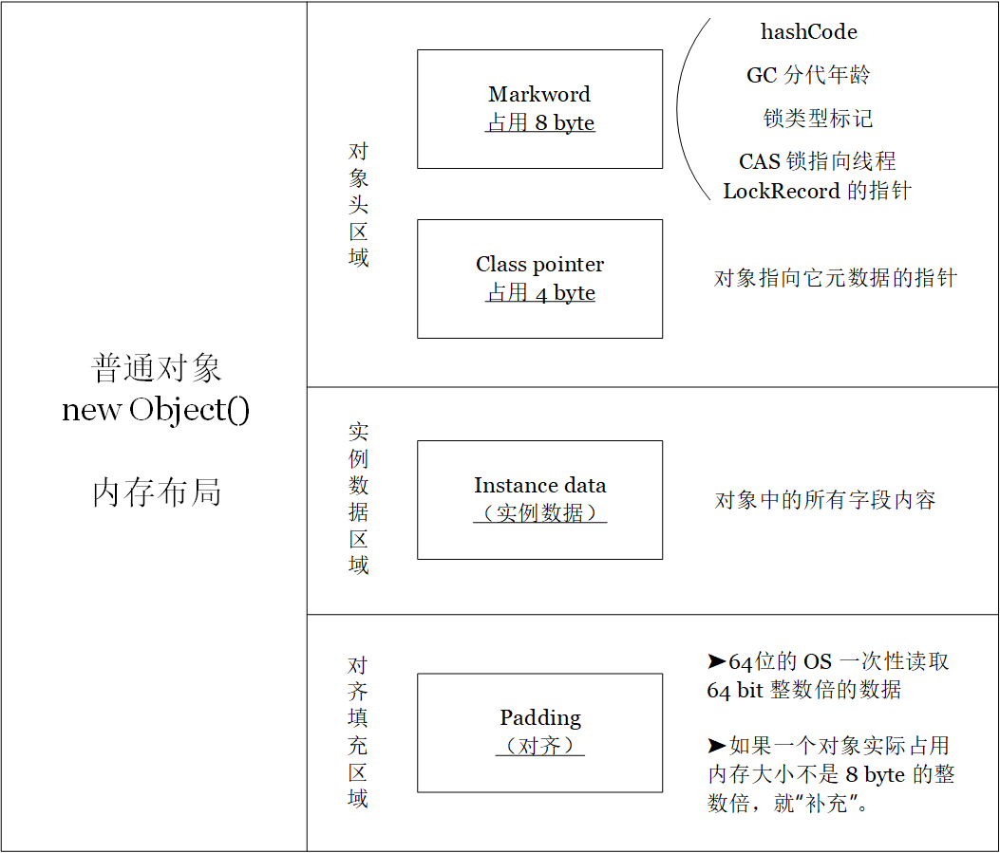
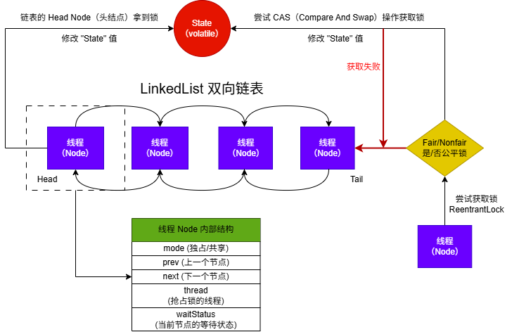
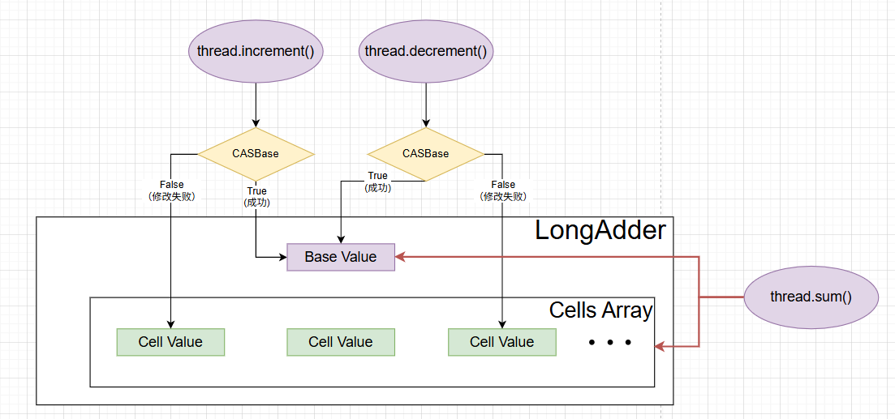

# 锁 🔒 Lock

## 悲观锁

> [!tip]
>
> **<span style="font-size:1.4em; color:#0080FF;">悲观锁</span>**：每次<span style="color:#FF0000;">只能有一个线程使用</span>，其它线程会 **阻塞**。
>
> - 总是假设最坏情况，认为共享资源每次被访问的时候都 **<u>会被修改</u>**
> - 每次获取资源操作都会上锁
> - 如果无法获取锁，就会阻塞到上一个持有者释放


Java 的 `synchronized` 和 `ReentrantLock` 等独占锁。

- `synchronfized` 依赖于<span style="color:#FF0000;"> JVM 实现</span>的，没有暴露接口。

- ReentrantLock 是 <span style="color:#FF0000;">JDK 层面（API 层面）实现</span>的，需要调用 `lock()` 和 `unlock()` 方法配合 `try/finally` 语句完成。

---

### synchronized

`synchronized` 关键字使用方式有 3 种：

- 修饰实例方法（锁当前对象实例）：`synchronized void method() {}`
- 修饰静态方法（锁当前类）：`synchronized static void method() {}`
- 修饰代码块（锁指定对象/类）：`synchronized (this) {}`

>  [!important]
>
> `static` 修饰的静态 synchronized 方法和  非静态 synchronized 方法 的调用不互斥。


####  synchronized 底层原理

> [!note]
>
> synchronized 有以下几个特点：
>
> - 锁升级过程
> - 可重入
> - 悲观锁


> <span style="color:#FF0000;">synchronized</span> 加锁原理与 Java 对象中内存中的布局相关，首先介绍 Java 对象内存布局。




|   ~ JDK 8   |  JDK 15~   |
| :---------: | :--------: |
|    无锁     |    无锁    |
| 偏向锁（✅） | 跳过偏向锁 |
|  轻量级锁   |  轻量级锁  |
|  重量级锁   |  重量级锁  |


1、偏向锁（<span style="color:#0080FF;">适用于单线程长期访问的场景</span>）

在 JDK8 中，对一个对象 Object 进行 `synchronized` 操作时，会立即申请一把偏向锁，当拥有偏向锁时，对象的 `markword` 会记录当前的线程 ID。

2、升级到轻量级锁（<span style="color:#0080FF;">适用于多线程交替进入临界区，无竞争或低竞争</span>）

当其它线程参与到偏向锁的竞争时，JVM 撤销偏向锁，升级为轻量锁。<u>每个线程在线程栈中生成一个 `LockRecord`（LR），每个线程通过 **<span style="font-family:Georgia;">CAS</span>** 操作将锁对象头中的 `markword`  指向自己的 LR 指针，哪个线程设置成功就意味着获得了锁</u>。

3、升级到重量级锁（<span style="color:#0080FF;">多线程同时竞争，操作系统内核调度</span>）

锁竞争加剧（线程自旋操作次数/线程数超过阈值），就会升级为重量级锁。

*此时会向操作系统申请资源，同时挂起线程，进入到操作系统内核态的等待队列中，等待操作系统调度。调度运行后，映射回用户态。*

---


#### synchronized 废弃偏向锁

> 偏向锁是 HotSpot 虚拟机的一项优化技术，提升单线程对同步代码块的访问性能，常用于早期的 Java 集合 API（HashTable、Vector）。


`ConcurrentHashMap` 高性能集合在内部实现了性能优化，偏向锁的性能收益降低（不明显）。同时，多线程竞争需要 <u><span style="color:#808080;">撤销偏向锁</span></u>，这个操作的性能开销很昂贵（需要等待进入全局安全点(Safe Point)），该状态下所有线程都是暂停的。

- JVM 内部代码维护成本太高


#### synchronized 与 volatile

|                         synchronized                         |                           volatile                           |
| :----------------------------------------------------------: | :----------------------------------------------------------: |
| <span style="color:#FF0000;">可以修饰变量、方法和代码块</span> |       <span style="color:#0080FF;">只能修饰变量</span>       |
|                   保证数据的可见性、原子性                   | 保证数据的可见性，<span style="color:#0080FF;">不保证原子性</span> |
| 关注多个线程之间的资源<span style="color:#FF0000;">同步性</span> | 解决多个线程之间的资源<span style="color:#0080FF;">可见性</span> |


### ReentrantLock

`ReentrantLock` 实现了 `Lock` 接口，是一个可重入且独占式的锁。基于 <span style="font-family:Georgia;">**AQS**</span>（AbstractQueueSynchronized）实现的， <span style="font-family:Georgia;">**AQS**</span> 基于 `volatile` 和 <span style="font-family:Georgia;">**CAS**</span> 实现。


<span style="font-family:Georgia;">**AQS**</span> 的模型如下




相比于 `synchronized`，`ReentrantLock` 还包括：

- 轮询：借助 <span style="color:#FF0000;">Condition 和 newCondition()</span> 方法实现选择性通知；
- 超时：提供 `tryLock(timeout)` 方法，<span style="color:#0080FF;">指定获取锁的最长等待时间</span>；
- 中断：`lock.lockInterruptibly();` 
- 公平锁：先申请的线程先获取被释放的锁（性能较差）
- 非公平锁：后申请的线程 <span style="color:#0080FF;">可能</span> 先得到被释放的锁（某些线程可能无法获取锁）

```java
public ReentrantLock(boolean fair) {
    sync = fair ? new FairSync() : new NonfairSync();
}
```


#### 线程中断

线程中断 `interrupt()` 将线程的<span style="color:#0080FF;">中断状态标志</span>设置为 true。

➤ 如 Object.wait()、Thread.sleep()、lock.lockInterruptibly() 在中断标志为 true 时会抛出 InterruptedException。

➤ 抛出 InterruptedException 异常后线程 **不会自动退出**，线程会自动跳转到 `catch` 代码块执行后续代码。

> [!important]
> 中断不是强行杀死线程，而是一个“温柔的提醒“。


## 乐观锁

>  [!tip]
>
> <span style="font-size:1.4em;">**<span style="color:#0080FF;">乐观锁</span>**</span>：
>
> - 总是假设最好情况，认为共享资源每次被访问时都 **<u>不会被修改</u>**
> - 获取资源无需加锁，无需等待
> - 提交时验证（版本号机制、<span style="font-family:Georgia;">**CAS**</span> 算法）


### 乐观锁

原子变量类：`java.util.concurrent.atomic` 包的原子变量类。

➤ AtomicInteger

➤ LongAddr

使用了乐观锁的一种实现方式 **<span style="font-family:Georgia;">CAS</span>** 实现的。


> [!tip]
>
> `LongAddr` 中高并发场景下通过 <span style="color:#FF0000;">空间换时间</span> 的代价比 `AtomicInteger` 和 `AtomicLong` 性能更好。


### 版本号机制

在数据表中加入 `version` 版本字段，表示<span style="color:#FF0000;">数据被修改的次数</span>。

- 当数据被修改时，`version++`（自增）；
- 线程 A 尝试更新数据值时，在提交更新时，只有当读取到的 `version` 值与当前数据库中的 `version` 值相等时才更新，否则重试更新操作，直到成功。


### <span style="font-family:Georgia;">CAS</span> 算法

> **<span style="font-family:Georgia;">CAS</span>** 全称 <span style="font-family:Georgia;">**Compare And Swap**</span>（比较与交换），用于实现乐观锁。

<span style="font-family:Georgia;">CAS</span> 是一个原子操作，底层依赖于一条 <span style="font-family:Georgia;">CPU</span> 的<span style="color:#FF0000;">原子操作</span>。

- ***原子操作* * ：<u>最小不可拆分的操作，一旦开始就不能被打断，直到操作完成</u>。*


<span style="font-family:Georgia;">CAS</span> 涉及到三个操作数

➤ <span style="font-family:Georgia;">**V**</span>：要更新的变量值（Variable）

➤ <span style="font-family:Georgia;">**E**</span>：预期值（Expected）

➤ **<span style="font-family:Georgia;">N</span>**：拟写入的新值（New）


多个线程同时使用 <span style="font-family:Georgia;">**CAS**</span> 操作一个变量时，只有一个线程会胜出并成功更新变量。其余的线程均会失败而且不会挂起，仅被告知失败。


#### ABA 问题

> <span style="color:#FF0000;"><span style="font-family:Georgia;">**ABA**</span> 问题 </span>：
>
> - <span style="font-family:Georgia;">**CAS**</span> 操作会在第一次读取和赋值时检测变量值，但是不能保证期间是否修改。


### LongAdder

高并发场景下对 Integer 类型的整数自增 `++` 时，无法保证操作的原子性。

一种解决方案是用 JUC（java.util.concurrent）下的原子类 `AtomicInteger`，其内部使用 <span style="font-family:Georgia;">**CAS**</span> 保证线程安全。但，<span style="color:#FF0000;">大量线程同时访问会导致 <span style="font-family:Georgia;">**CAS**</span> 操作失败而一直自旋（<span style="font-family:Georgia;">**CPU**</span> 资源消耗过多）</span>。

另一种解决方案是 Doug Lea 在 JDK8 中提出的基于 <span style="font-family:Georgia;">**CAS**</span> 分段锁实现的 `LongAdder`。


线程读取 `LongAdder` 类型的变量流程如下：



> `LongAdder` 的父类 `Striped64` 维护着一个 <span style="color:#0080FF;">base</span> 变量和一个 <span style="color:#0080FF;">cell</span> 数组。
>
> - 少量线程操作该变量时会在 <span style="color:#0080FF;">base</span> 上进行 <span style="font-family:Georgia;">**CAS**</span> 操作；
>
> - 线程数量增多时，该变量会使用 <span style="color:#0080FF;">cell</span> 数组。
>
>   > [!tip]
>   >
>   > 在 base 变量上操作失败的线程会对应并操作一个 cell 变量，分散并发压力。这种分段锁需要额外维护内存空间，但高并发条件可以忽略该成本。


> [!note]
>
> 分段锁（**Striped Lock**）是一种 **将竞争资源划分为多个独立部分**，从而 **降低锁竞争** 的优化策略。核心思想是：
>
> > **把一个大锁拆分成多个小锁**，让不同线程在不同段（Segment）上并发执行，从而提升性能。
>
> LongAdder 中的 `cell[]` 是一种无锁的分段并发结构，思想类似于“分段锁”——通过 ***<u>分散热点</u>***、<u>***减少竞争***</u>，从而提高高并发下的性能。