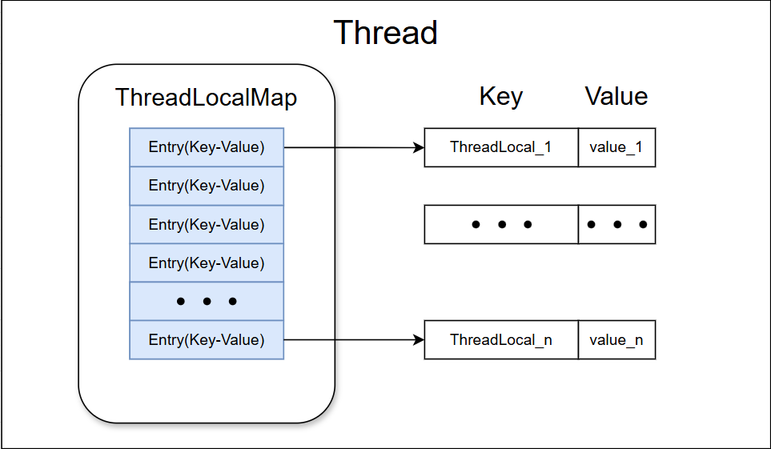
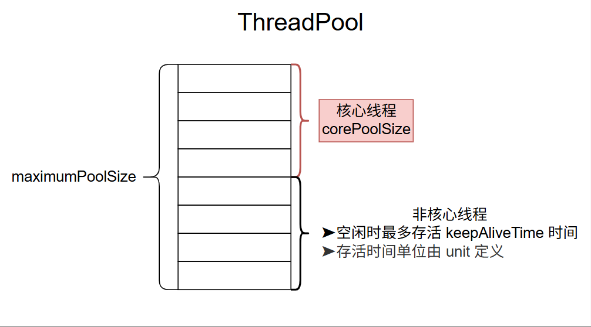

# Java Concurrent

## ThreadLocal

> `ThreadLocal` 类允许每个线程绑定自己的专属本地变量值。

当前线程在获得 `ThreadLocal` 对象后会创建两个 `ThreadLocalMap` 对象：threadLocals、inheritableThreadLocals。

> *每个 Thread 中都具备一个 ThreadLocalMap，以 ThreadLocal 作为 Key、Object 对象作为 Value 的键值对。*




### ThreadLocal.set()

```java
private void set(Thread t, T value) {
    // Thread 类内部的 ThreadLocalMap（哈希表结构）
    ThreadLocalMap map = getMap(t);
    if (map != null) {
        map.set(this, value);
    } else {
        createMap(t, value);
    }
}
```


### **<u>⭐Thread 内存泄露问题</u>**

> [!tip]
>
> 1. 当 `ThreadLocal` 实例不再被强引用；
> 2. 线程持续存活，导致 `ThreadLocalMap` 长期存活；

当满足上面两个条件时，ThreadLocal 会导致<span style="color:#FF0000;">内存泄露</span>问题。


原因：`ThreadLocalMap` 的弱引用 Key 和 强引用 Value 导致的垃圾回收机制 GC 回收了 Key 而无法回收 Value。


避免方法：

1. 在使用完 `ThreadLocal` 后，务必调用 `remove()` 方法。 `remove()` 方法会从 `ThreadLocalMap` 中显式地移除对应的 entry，彻底解决内存泄漏的风险。 
2. 在线程池等线程复用的场景下，使用 `try-finally` 块可以确保即使发生异常，`remove()` 方法也一定会被执行


### **<u>⭐跨线程传递 ThreadLocal 值</u>**

> [!important]
>
> 在异步场景下父子线程的 `ThreadLocal` 值无法进行传递。

有两种解决方案：

- `InheritableThreadLocal`：JDK1.2 提供的工具。能够支持子线程继承父线程的 `ThreadLocal` 的值，但无法满足线程池场景。
- `TransmittableThreadLocal`（TTL）：阿里巴巴开源的工具类，继承并加强了 `InheritableThreadLocal` 类，可以在线程池的场景下支持 `ThreadLocal` 值传递。


 <span style="font-family:Georgia;">**TTL**</span> 实现了两处逻辑的改动：

➤ 实现自定义 Thread，在 run() 方法内部做 ThreadLocal 变量的赋值操作。

➤ 基于 **线程池** 实现<u>装饰器模式</u>，中 execute() 方法不提交 JDK 的 Thread 而是提交自定义的 Thread。


```xml
<dependency>
	<groupId>com.alibaba</groupId>
    <artifactId>
        transmittable-thread-local
    </artifactId>
    <version>2.12.0</version>
</dependency>
```

## ThreadPool

线程池提供了一种限制和管理资源（包括执行一个任务）的方式。 每个<span style="color:#0080FF;">线程池还维护一些基本统计信息</span>，例如已完成任务的数量。

使用线程池的好处是<span style="color:#FF0000;">减少在创建和销毁线程上所消耗的时间以及系统资源开销</span>，解决资源不足的问题。如果不使用线程池，有可能会造成系统创建大量同类线程而导致消耗完内存或者“过度切换”的问题。

---

###  使用 `ThreadPoolExecutor` 构造函数直接创建线程池

```java
public ThreadPoolExecutor(
	int corePoolSize,    // 线程池核心线程数量
    int maximumPoolSize, // 线程池的最大线程数量
    long keepAliveTime,  // 线程数大于核心线程数时，多余的空闲线程存活的最长时间
    TimeUnit unit,		 // 时间单位
    BlockingQueue<Runnable> workQueue, // 任务队列
    ThreadFactory threadFactory,       // 线程工厂（一般默认）
    RejectedExecutionHandler handler   // 拒绝策略：任务过多的处理方案
)
```


主要了解各个参数的作用和选择逻辑。

---

`corePoolSize` 和 `maximumPoolSize`：

> [!TIP]
>
> 线程池大小设置过大或者过小都会有问题，合适的才是最好

一个简单并且适用面比较广的公式：

> **CPU 密集型任务(N+1)：** 这种任务消耗的主要是 <span style="font-family:Georgia;">**CPU**</span> 资源，可以将线程数设置为 N（CPU 核心数）+1。<span style="color:#0080FF;">比 <span style="font-family:Georgia;">**CPU**</span> 核心数多出来的一个线程是为了防止线程偶发的缺页中断</span>，或者其它原因导致的任务暂停而带来的影响。一旦任务暂停，<span style="font-family:Georgia;">**CPU**</span> 就会处于空闲状态，而在这种情况下多出来的一个线程就可以充分利用 <span style="font-family:Georgia;">**CPU**</span> 的空闲时间。
>
> **I/O 密集型任务(2N)：** 这种任务应用起来，系统会用大部分的时间来处理 I/O 交互，而<span style="color:#0080FF;">线程在处理 I/O 的时间段内不会占用 <span style="font-family:Georgia;">**CPU**</span> 来处理</span>，这时就可以将 <span style="font-family:Georgia;">**CPU**</span>  交出给其它线程使用。因此在 I/O 密集型任务的应用中，可以多配置一些线程，具体的计算方法是 2 * N。

- 核心线程 **默认下** 不会回收核心线程；
- 核心线程根据是否定义超时时间（`timed`）选择使用 `poll()`（非阻塞）/`take()`（阻塞）来获取任务，当使用 `poll()` 方法获取任务超时后，线程会退出（进入 TERMINATED），并移除出线程池。



---

`RejectedExecutionHandler handler`：拒绝策略

- `ThreadPoolExecutor.AbortPolicy`：抛出 `RejectedExecutionException`来拒绝新任务的处理。（<span style="color:#0080FF;">丢失对任务的处理</span>）
- `ThreadPoolExecutor.CallerRunsPolicy`：调用执行者自己的线程运行任务，也就是直接在调用`execute()`方法的线程（<span style="color:#FF0000;">父线程</span>）中运行`run()` （<span style="color:#FF0000;">子线程</span>）被拒绝的任务，如果执行程序已关闭，则会丢弃该任务。因此这种策略会降低对于新任务提交速度，影响程序的整体性能。如果你的应用程序可以承受此延迟并且你要求任何一个任务请求都要被执行的话，你可以选择这个策略。（<span style="color:#0080FF;">父线程完成子线程未完成的任务</span>）
- `ThreadPoolExecutor.DiscardPolicy`：不处理新任务，直接丢弃掉。
- `ThreadPoolExecutor.DiscardOldestPolicy`：此策略将丢弃最早的未处理的任务请求。


> [!NOTE]
>
> 使用 `CallerRunsPolicy` 的执行策略本质上是为了确保所有任务都能完成，但是耗时的任务用了主线程执行，导致线程池阻塞，进而导致后续任务无法及时执行，严重的情况下很可能导致  <span style="font-family:Georgia;">**OOM（Out of Memory）**</span> ，下面是几种解决方案：
>
> - （内存允许的情况下）增加阻塞队列`BlockingQueue`的大小并调整堆内存
> - （充分利用  <span style="font-family:Georgia;">**CPU**</span> ）调整线程池的`maximumPoolSize` （最大线程数）参数
> - 构建 **持久化任务**：
>   - 设计任务表并存在  <span style="font-family:Georgia;">**MySQL**</span>  数据库中
>   - <span style="font-family:Georgia;">**Redis**</span> 缓存任务
>   - 将任务提交到消息队列中
> -  <span style="font-family:Georgia;">**Netty**</span>  创建一个新的线程池以外的线程来监控并处理这些任务

---

`BlockingQueue<Runnable> workQueue`：阻塞任务队列

|                   阻塞队列                    |                             说明                             |
| :-------------------------------------------: | :----------------------------------------------------------: |
|   (LinkedBlockingQueue) **FixedThreadPool**   |  最多只能创建核心线程数的线程（核心线程数和最大线程数相等）  |
|  (LinkedBlockingQueue) **SingleThreadPool**   |                      *只能创建一个线程*                      |
|    (SynchronousQueue) **CachedThreadPool**    | 同步队列，目的是<span style="color:#FF0000;">保证对于提交的任务</span>，如果有空闲线程，则使用空闲线程来处理；否则新建一个线程来处理任务。 |
| (DelayedWorkQueue) <u>ScheduledThreadPool</u> | 保证每次出队的任务都是当前队列中执行时间最靠前的。<br />添加元素满了之后会 *自动扩容*，<span style="color:#FF0000;">增加原来容量的 50%</span>，即永远不会阻塞 |
|              ArrayBlockingQueue               |            底层由数组实现，容量创建后就无法修改。            |


### <u>⭐️线程池中线程异常后，销毁还是复用</u>

> 1. 使用`execute()`时，未捕获异常导致线程终止，线程池创建新线程替代；
>
> 2. 使用`submit()`时，异常被封装在`Future`对象中返回。当调用`Future.get()`方法时，可以捕获到一个`ExecutionException`，线程继续复用。


### 设计一个根据任务的优先级来执行的线程池

 `PriorityBlockingQueue` 实现对任务的排序，传入其中的任务必须是具备排序能力的，方式有两种：

1. 提交到线程池的任务实现 `Comparable` 接口，并重写 `compareTo` 方法来指定任务之间的优先级比较规则。
2. 创建 `PriorityBlockingQueue` 时传入一个 `Comparator` 对象来指定任务之间的排序规则(推荐)。


<span style="color:#FF0000;">存在的问题</span>：

- `PriorityBlockingQueue` 是无界的，可能堆积大量的请求，从而导致 OOM。
  - <span style="color:#0080FF;">解决 OOM</span>：继承`PriorityBlockingQueue` 并重写一下 `offer` 方法(入队)的逻辑，当插入的元素数量超过指定值就返回 false 。

- 可能会导致饥饿问题，即低优先级的任务长时间得不到执行。

- 由于需要对队列中的元素进行排序操作以及保证线程安全（并发控制采用的是可重入锁 `ReentrantLock`），因此会降低性能。


## CompletableFuture

`CompletionStage` 接口描述了一个异步计算的阶段。很多计算可以分成多个阶段或步骤，此时可以通过它将所有步骤组合起来，形成异步计算的流水线。


例如场景：

- 任务编排场景非常适合通过`CompletableFuture`实现。这里假设要实现 T3 在 T2 和 T1 执行完后执行。

```java
// T1
CompletableFuture<Void> futureT1 = CompletableFuture.runAsync(() -> {
    System.out.println("T1 is executing. Current time：" + DateUtil.now());
    // 模拟耗时操作
    ThreadUtil.sleep(1000);
});
// T2
CompletableFuture<Void> futureT2 = CompletableFuture.runAsync(() -> {
    System.out.println("T2 is executing. Current time：" + DateUtil.now());
    ThreadUtil.sleep(1000);
});

// 使用allOf()方法合并T1和T2的CompletableFuture，等待它们都完成
CompletableFuture<Void> bothCompleted = CompletableFuture.allOf(futureT1, futureT2);
// 当T1和T2都完成后，执行T3
bothCompleted.thenRunAsync(() -> System.out.println("T3 is executing after T1 and T2 have completed.Current time：" + DateUtil.now()));
// 等待所有任务完成，验证效果
ThreadUtil.sleep(3000);
```

